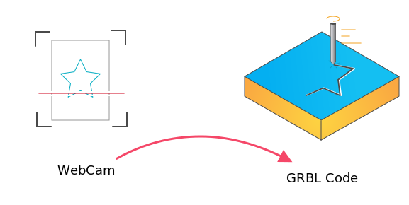

# HoruCNC ([horu](https://glosbe.com/ja/en/horu))

CNC machines are an essential part of the hacker’s toolset. These computer-controlled cutters of wood, metal and other materials can translate a design into a prototype in short order, making the process of iterating a project much easier. However, the software to create these designs can be expensive and complex.

The motivation for this project was to reduce the effort of toolpath generation and the frustration at the cost of commercial software. 

## What is the philosophy behind HoruCNC?
Dead simple - design and print your template with any kind of software you like, scan it with your WebCam, and press the **Carve** button to send your GRBL code direct to your CNC mill.

Read more on [documentation page](https://freegroup.github.io/HoruCNC/)
 

Of course, this method has several disadvantages such as, accuracy, complex calculated travel paths, ... but high precision is not what the software is designed for. It should be very easy to make cutters for cookies, stamps and engravings of name plates. Everything where an accuracy of 0.01mm is not required.

It should be possible that not CNC and CAD users should be able to engrave a stamp or a name plate in minutes. Possibly the software simply extends the standard tool set of a CAD expert if he want to engrave something without having to create a 3D model.

## Youtube Demo
    
    

   
https://nb.paulbutler.org/surface-projection/
https://trmm.net/Hidden_Wireframe/
https://hackaday.com/2020/12/13/a-3d-to-2d-converter-to-make-plots-from-stls/
https://www.fwei.tk/blog/opening-black-boxes.html
