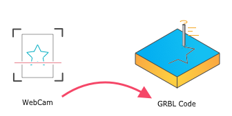

# HoruCNC ([horu](https://glosbe.com/ja/en/horu))

CNC machines are an essential part of the hacker’s toolset. These computer-controlled cutters of wood, metal and other materials can translate a design into a prototype in short order, making the process of iterating a project much easier. However, the software to create these designs can be expensive and complex.

The motivation for this project was to reduce the effort of toolpath generation and the frustration at the cost of commercial software. 

## What is the philosophy behind HoruCNC?




## Get the software running
The software is written in Python3 for convenience. Python has a very good interface to OpenCV for image processing, which is heavily used here.

``` 
git clone https://github.com/freegroup/HoruCNC.git
cd HoruCNC

pip3 install opencv-python
sudo apt install python3-opencv
sudo apt install libqt4-test
pip3 install -r requirements.txt

python3 ./src/main.py
```
