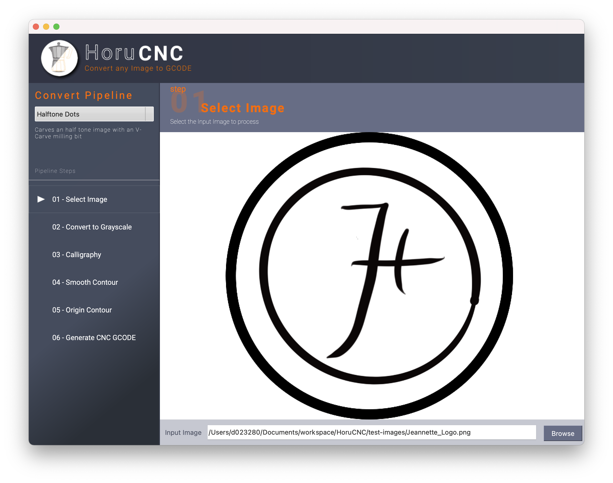

# HoruCNC ([horu](https://glosbe.com/ja/en/horu))
 


CNC machines are an essential part of the hacker’s toolset. These computer-controlled cutters of wood, metal and other materials can translate a design into a prototype in short order, making the process of iterating a project much easier. However, the software to create these designs can be expensive and complex.

The motivation for this project was to reduce the effort of toolpath generation and the frustration at the cost of commercial software. 




Read more on the [Project Page](https://freegroup.github.io/HoruCNC/)


## Build the distribution

``` 
# Update the Qt resource file
#
pyside2-rcc ./src/main/resources/base/ui/resources.qrc -o ./src/main/python/ui/resources.py

# Update the ICNS Icons if anything within the iconset folder has changed
#
iconutil -c icns ./HoruCNC.iconset

# build the HoruCNC.app
#
rm -r ./build
rm -rf ./dist

./venv/bin/pyinstaller --hidden-import=pkg_resources.py2_warn -y --clean --windowed main.spec
# python setup.py py2app

cp -R ./venv/lib/python3.9/site-packages/shiboken2 ./dist/main.app/Contents/Resources/lib/python3.9/lib-dynload/shiboken2

cp ./venv/lib/python3.9/site-packages/shiboken2/libshiboken2.abi3.5.15.dylib ./dist/main.app/Contents/Resources/lib/python3.9/lib-dynload/shiboken2

# build the DMG Image
#
dmgbuild -s ./src/dmg.py "HoruCNC" ./dist/HoruCNC.dmg

```

