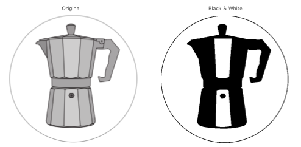
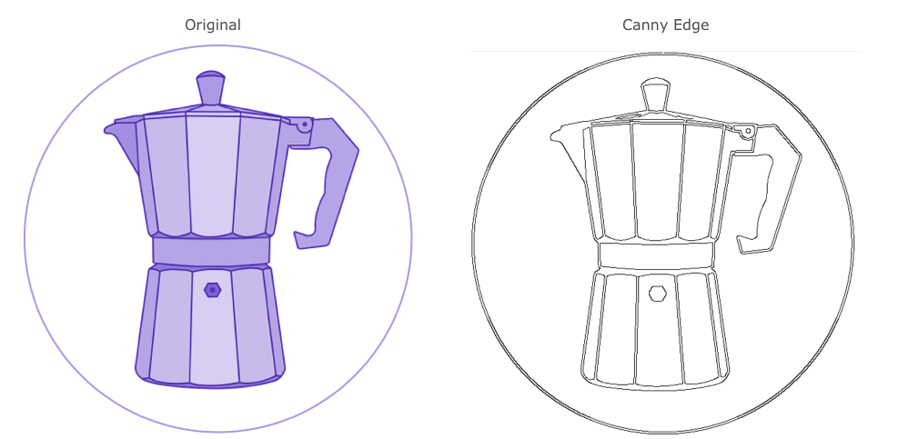
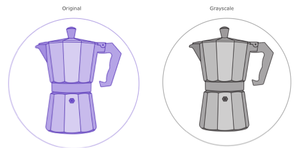
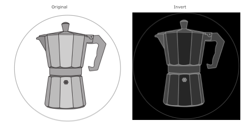

# Image to Image Filter

Image filters gets an 3 channel image as input and returns a 3-channel image as result. 


{: .text-center}

## Black&White
{: .filter-header}

Thresholding is the simplest method of image segmentation. It is a non-linear operation that converts a gray-scale image into a binary image where the two levels are assigned to pixels that are below or above the specified threshold value. In other words, if pixel value is greater than a threshold value, it is assigned one value (may be white), else it is assigned another value (may be black). In OpenCV, I use the cv2.threshold() function.

### Effect

{: .mx-auto .text-center}

### Pipeline Configuration
```ini
###########################################################################################
# Converts graylevel to black&white. The user can define the threshold in the UI
###########################################################################################
#
[processing.image.black_white.Filter]
# The threshold defines all values below that "graylevel" are not part of the outline to carve
#
threshold = 89
# visible in the user menu bar
#
menu = true

```


## Canny Edge
{: .filter-header}

Edge detection is one of the fundamental operations when we perform image processing. It helps us reduce the amount of data (pixels) to process and maintains the structural aspect of the image. We're going to look into many people think it as the ultimate edge detectorm Canny Edge Detection. With this detector, we get clean, thin edges that are well connected to nearby edges.

### Effect

{: .mx-auto .text-center}

### Pipeline Configuration
```ini
[processing.image.edge_canny.Filter]
# visible for the user interaction
#
menu = true
# default threshold. Adjustable in the UI
threshold = 103

```


## Grayscale
{: .filter-header}

Converts color images to grayscale. Grayscale is the perfect starting point for edge detection and should be done at the very beginning of your pipeline.

### Effect


{: .mx-auto .text-center}

### Pipeline Configuration
```ini
###########################################################################################
# Converts colored image to graylevel
###########################################################################################
[processing.image.grayscale.Filter]
menu = true

```


## Invert
{: .filter-header}
Inverts the color of an grayscale image. 
Normaly **black** is carved as the deepest and white isn't carved at all. This is the perfect filter if you want to invert this behaviour.


{: .mx-auto .text-center}


### Pipeline Configuration
```ini
[processing.image.invert.Filter]
# visibility for the user.
#
menu = false

```

## Outline
{: .filter-header}
It is the difference between the dilation and the erosion of an grayscale image. The result is more detailed than that of Canny Edge. Here you can see the "belly button" of the mocha pot.

Additional the result is grayscale in comparison to the canny edge, which is black&white.


{: .mx-auto .text-center}

### Pipeline Configuration
``` 
[processing.image.outline.Filter]
# visibility for the user.
#
menu = true

```


## Smooth Average
{: .filter-header}
This is done by convolving an image with a normalized box filter. It simply takes the average of all the pixels under the kernel area and replaces the central element. 

### Effect

{: .mx-auto .text-center}

### Pipeline Configuration
``` 
[processing.image.smooth_average.Filter]
# visibility for the user.
#
menu = true
factor = 255
```


## Smooth Bilateral
{: .filter-header}

The bilateral filter is highly effective in noise removal while keeping edges sharp. But the operation is slower compared to other filters.

### Effect

{: .mx-auto .text-center}

### Pipeline Configuration
``` 
###########################################################################################
# Blur the image to remove some possible noise. This is good for noisy background of
# bad light
###########################################################################################
[processing.image.smooth_bilateral.Filter]
# the bilateral blur factor
#
factor = 1

# visible in the user menu bar
#
menu = true

```


