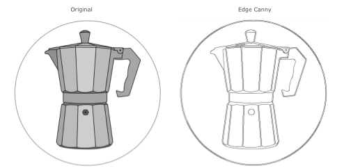

# Image Filter

Image filters gets an 3 channel image as input and returns a 3-channel image as result. An basic example of an image filter is the grayscale to black&white conversion below.


## Black&White
{: .text-purple-200}


### Description
Thresholding is the simplest method of image segmentation. It is a non-linear operation that converts a gray-scale image into a binary image where the two levels are assigned to pixels that are below or above the specified threshold value. In other words, if pixel value is greater than a threshold value, it is assigned one value (may be white), else it is assigned another value (may be black). In OpenCV, I use the cv2.threshold() function.

### Effect

{: .mx-auto .text-center}

### Pipeline Configuration
```ini
###########################################################################################
# Converts graylevel to black&white. The user can define the threshold in the UI
###########################################################################################
#
[processing.image.black_white.Filter]
# The threshold defines all values below that "graylevel" are not part of the outline to carve
#
threshold = 89
# visible in the user menu bar
#
menu = true

```

## Canny Edge

### Description
Edge detection is one of the fundamental operations when we perform image processing. It helps us reduce the amount of data (pixels) to process and maintains the structural aspect of the image. We're going to look into many people think it as the ultimate edge detectorm Canny Edge Detection. With this detector, we get clean, thin edges that are well connected to nearby edges.

### Effect

{: .mx-auto .text-center}


## Grayscale

### Description
Converts color images to grayscale. Grayscale is the perfect starting point for edge detection and should be done at the very beginning of your pipeline.

### Effect


{: .mx-auto .text-center}

### Pipeline Configuration
```ini
###########################################################################################
# Converts colored image to graylevel
###########################################################################################
[processing.image.grayscale.Filter]
menu = true

```


## Invert
Inverts the color of an grayscale image. 
Normaly **black** is carved as the deepest and white isn't carved at all. This is the perfect filter if you want to invert this behaviour.


{: .mx-auto .text-center}


## Outline

## Smooth Average

## Smooth Bilateral

### Description
The bilateral filter is highly effective in noise removal while keeping edges sharp. But the operation is slower compared to other filters.

### Effect

### Pipeline Configuration
``` 
###########################################################################################
# Blur the image to remove some possible noise. This is good for noisy background of
# bad light
###########################################################################################
[processing.image.smooth_bilateral.Filter]
# the bilateral blur factor
#
factor = 1

# visible in the user menu bar
#
menu = true

```

## Thinning

## Truncate


