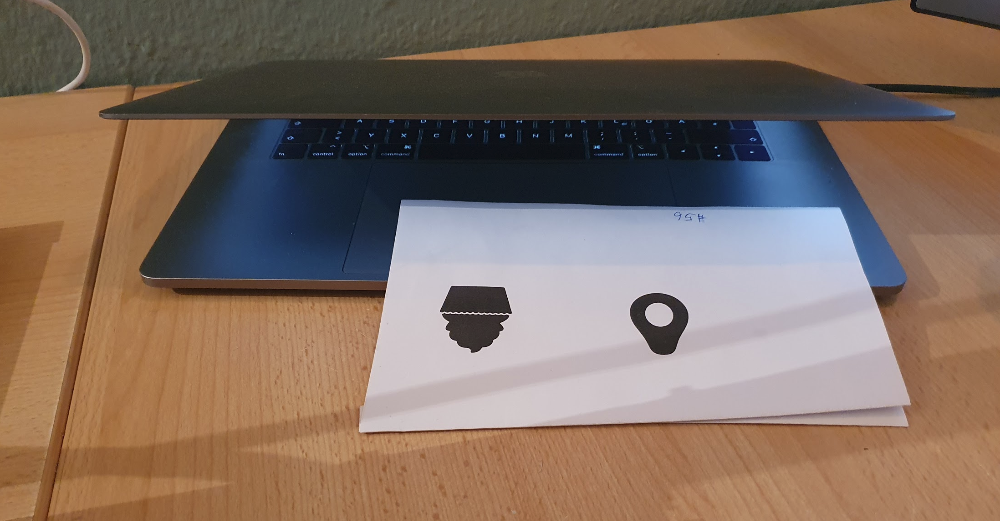
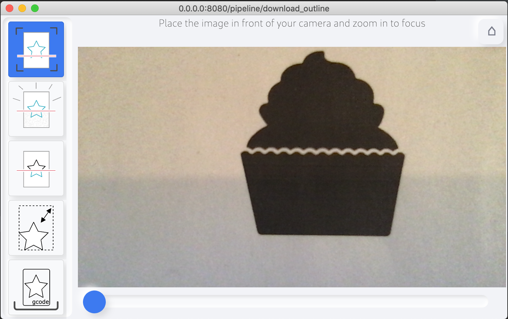
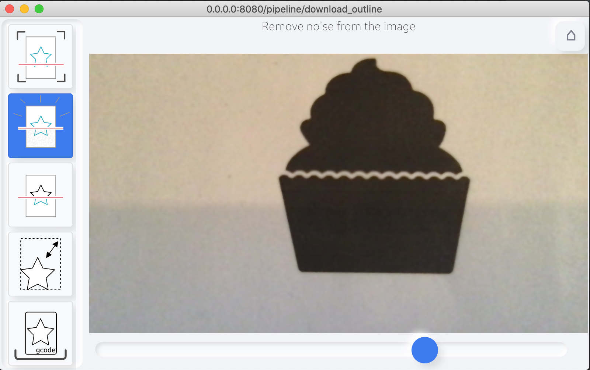
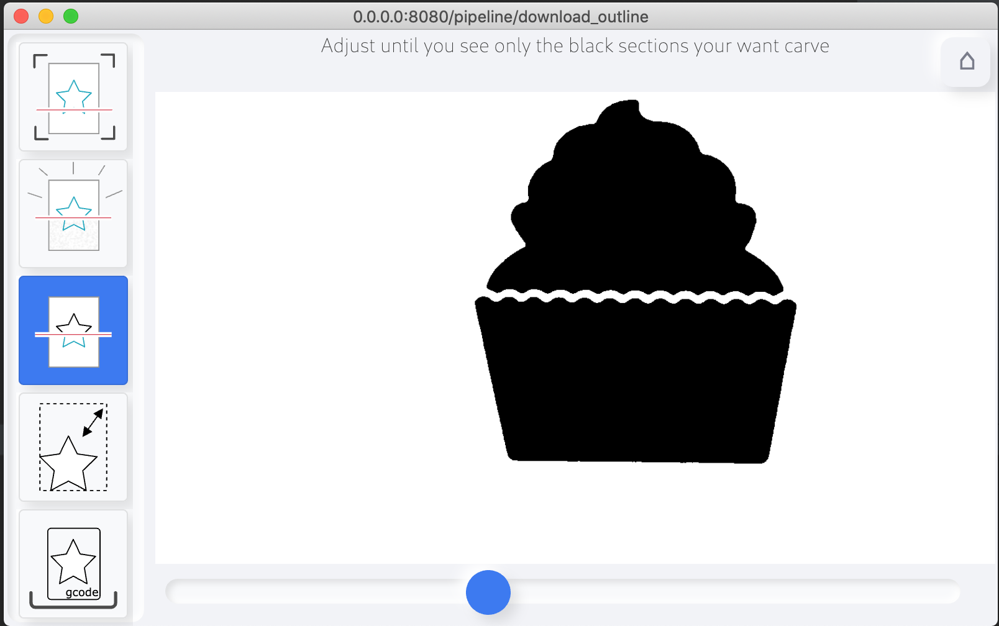
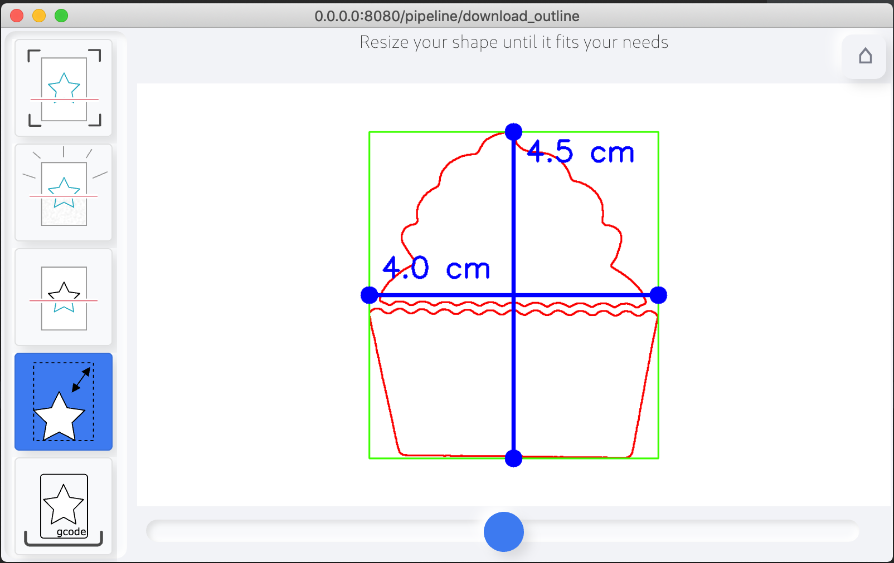
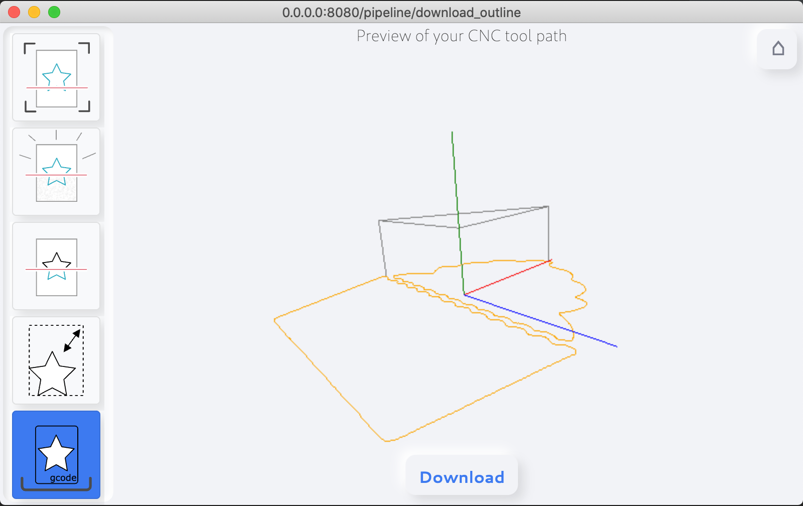

# Cupcake to GCode

In this example a simple print/template is used to generate the carving GCode.

## In the foreground
All of the settings can be changed in the UI with simple slider. How can control each conversion step one by one.

### 1.) Place the print in front of the camera


### 2.) Control the camera viewpoint
Control the viewpoint of the camera and zoom in/out to focus your desired target



### 3.) Remove camera noise
You can remove some noise of the camera with a gausian blur filter. This helps a lot
before the image goes into the Black&White mode.



### 4.) Convert to Black&White
You can adjust the threshold until you see the part you want to engrave the outer edges of.



### 5.) Resize the Outline
Define the dimension of your target GCode shape



### 6.) Preview and Download GCode
You can preview and download now the generated GCode.




## Behind the scene
In HoruCNC no fixed procedures are programmed how an image is converted to a GCode. All workflows are stored in a kind of pipeline in INI files and can be extended, changed or completely new ones can be created.

In the home screen of HoruCNC these INI files can be selected.

The pipeline described here is updated as follows...I hope the comments in the file are self-explanatory

```ini

####################################################################################################
# This is a processing pipeline for the Image -> GCode conversion
#
# All filters are applied in the sequence in which they are named.
#
# For debugging purpose you can show/hide each filter in the UI menu by the "menu" flag in the filter
# settings.
#
####################################################################################################

###########################################################################################
# The "common" section contains some meta information about the pipeline.
# This data is shown in the overview.
###########################################################################################
#
[common]
author = Andreas Herz
name = Download Shape Outline GCode
description = Generates the carving outline of an Black&White image


###########################################################################################
# Reads the input image from the connected WebCam
###########################################################################################
#
[processing.source.camera.Camera]
# the default zoom level of the camera image. User can change this in the UI
#
zoom = 0
# is visible in the left menu bar
#
menu = true


###########################################################################################
# Blur the image to remove some possible noise. This is good for noisy background of
# bad light
###########################################################################################
#
[processing.image.blur.Filter]
# the gausian blur factor
#
factor = 181
# visible in the user menu bar
#
menu = true


###########################################################################################
# Convert the RGB image to gray. Required for all outline and graylevel based filter
###########################################################################################
#
[processing.image.grayscale.Filter]
# not visible for the user. Working in the background
#
menu = false


###########################################################################################
# Converts graylevel to black&white. The user can define the threshold in the UI
###########################################################################################
#
[processing.image.black_white.Filter]
# The threshold defines all values below that "graylevel" are not part of the outline to carve
#
threshold = 102
# visible in the user menu bar
#
menu = true


###########################################################################################
# Invert the image from Black&White to White&Black
###########################################################################################
#
[processing.image.invert.Filter]
# Not visible in the menu bar
#
menu = false


###########################################################################################
# Calculate the contour from the "WHITE" parts of the image.
###########################################################################################
#
[processing.image.to_contours.Filter]
# Not visible in the menu bar
#
menu = false


###########################################################################################
# Moves the contour into the center of the workarea.
###########################################################################################
#
[processing.contours.center_contours.Filter]
# Not visible in the menu bar
#
menu = false


###########################################################################################
# Scales the contour to the given "WIDTH" and create GCODE from the contour
###########################################################################################
#
[processing.contours.to_scaled_gcode.Filter]
# the final width of the carved outline
#
width_in_mm = 40

# depth of the carving in [mm]
#
depth_in_mm = 0.5

# feed rate of the mill in [mm]/[minutes]
# feed rapid, move without carving, is two time faster
feed_rate = 150

# clearance above the workpiece in [mm]
#
clearance = 10

# possible values are [mm] and [cm]
#
display_unit = cm

# visible in the UI. User can interactively change the width
#
menu = true
 
```