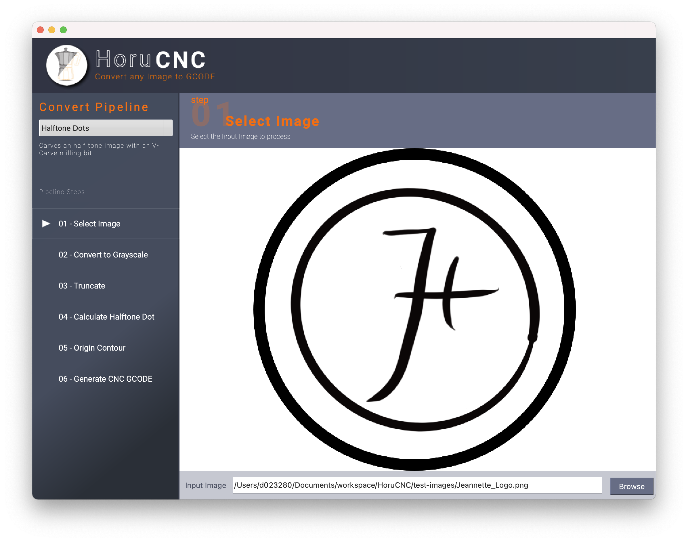

# Why HoruCNC 
---
**It should be possible that non CNC and CAD professional should be able to engrave a stamp or a name plate in minutes. Possibly the software simply extends the standard tool set of a CAD expert if he want to engrave something without having to create a 3D model.**

---

Just design your template with any kind of software you like or scan any existing image with your WebCam, and press the Carve button to send your GRBL code direct to your CNC mill.

HoruCNC instantly converts photos or images into toolpaths that can be run on virtually all CNC routing and engraving machines.

Of course, this method has several disadvantages such as, accuracy, complex calculated travel paths, ... but high precision is not what the software is designed for. It should be very easy to make cutters for cookies, stamps and engravings of name plates. Everything where an accuracy of 0.01mm is not required.

