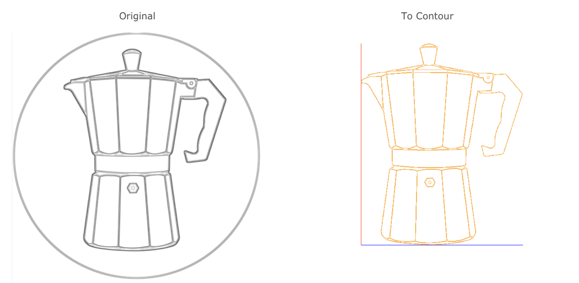

# Image to Contour Filter
This kind of filters gets an 3 channel image as input and returns a collection of contours of paths as result. 


{: .text-center}

## To Contours
Scannes the outline of the **black** areas and generates vector data. The vector data has an *height* of `0`. 

### Effect

{: .mx-auto .text-center}

### Pipeline Configuration
```ini

###########################################################################################
# Calculate the contour from the "BLACK" parts of the image.
###########################################################################################
#
[processing.image.to_contours.Filter]
# Not visible in the menu bar
#
menu = false

```