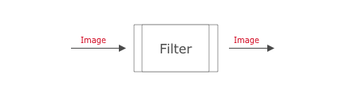
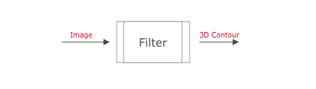
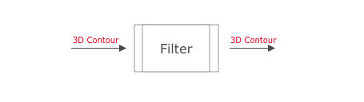

# Image Filter

A *filter* is an object made from a simple python file that has processing functions called from the main app. The main processing function is passed a single video frame or contour data. That data can be examined and/or modified. The new data can then be passed back to the main app.

## Image to Image Filter
This kind of filter fits best to adjust the brightness or remove noise from image. You can even convert color images to black&white for easy contour and outline detection.

{: .text-center}

## Image to Contour Filter
Detects contours and outlines or generates height maps from grayscale images. After this kind of filter you can deal with vector data instead of pixel based data source. This is called vertorization. Conversion, or vectorization, involves taking your raster and converting it to a vector. Vector data is the required input format to generate GCode for your CNC machine.

{: .text-center}

## Contour to Contour Filter
The vector data, contours are vectors, can now lossless scaled, rotated or you can defined the carving depth for your router.

{: .text-center}
